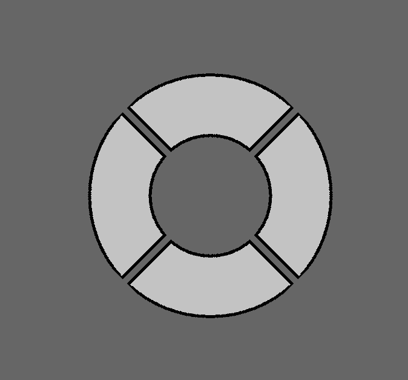

# bevy_prototype_interaction

Bevy_prototype_interaction intends to provide a flexible and robust system for interaction when working on [Bevy](https://github.com/bevyengine/bevy) projects.

Some goals:
- [x] Enable the composition of many simple shapes into arbitrarily complex regions, which can then be tested for mouse interaction.
- [ ] Include image shape-primitives for simple alpha-testing and rasterised SDFs.
- [ ] Try to minimise overhead by building a callable object

Down the line:
- [ ] Enable debug bounds rendering
- [ ] Possibly integrate with a UI system
- [ ] Consider providing an ergonomic api to enable interaction with 2d/sprite entities
- [ ] could be useful if an image (alpha-type) can be written to by the GPU. Would enable interaction with dynamically changing regions

## License

Code in this repository is dual-licensed under either:

* MIT License ([LICENSE-MIT](LICENSE-MIT) or [http://opensource.org/licenses/MIT](http://opensource.org/licenses/MIT))
* Apache License, Version 2.0 ([LICENSE-APACHE](LICENSE-APACHE) or [http://www.apache.org/licenses/LICENSE-2.0](http://www.apache.org/licenses/LICENSE-2.0))

at your option. This means you can select the license you prefer!

Unless you explicitly state otherwise, any contribution intentionally submitted
for inclusion in the work by you, as defined in the Apache-2.0 license, shall be dual licensed as above, without any
additional terms or conditions.
